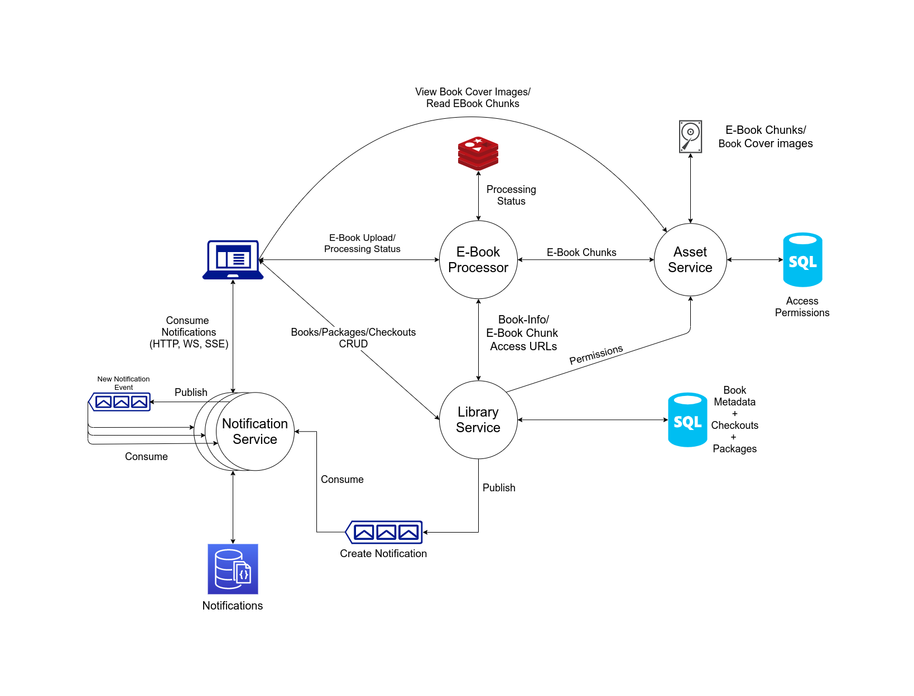

# E-Library

This system is part of the Niketan project.

## Functional Requirements
Refer to [requirements.pdf](./requirements.pdf)

## System Architecture Diagram:

## Tech Stack
1. PostgreSQL
2. MongoDB
3. Redis
4. Kafka
5. Spring Boot
6. Reactive Streams

## How to use?
1. Build the artifacts `sh build.sh`
2. Launch all services `sh start.sh`
3. See status of all services `sh status.sh`
4. Stop all services `sh stop.sh`

## NOTE:
1. Refer to individual services for their 
requirements and behaviour
2. The project uses Docker, not all the services are publicly accessible,
check which services are accessible by 

    `sh status.sh`